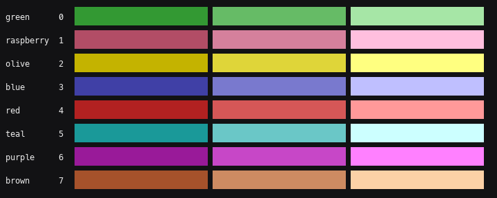
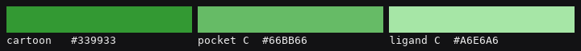
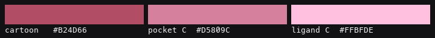
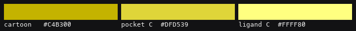
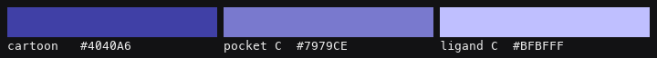
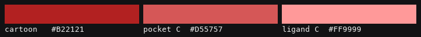
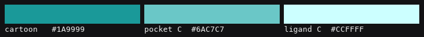
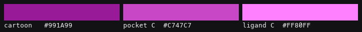
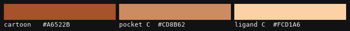

Color schemes
==============

Molecules loaded together must not look alike. Each gets one hue: a **dark
cartoon**, a **mid-tone for the pocket carbons**, and a **bright ligand
carbon** color, so a ligand obviously belongs to its own protein while still
catching the eye.

.. list-table::
   :header-rows: 1
   :widths: 6 16 20 20 20

   * - #
     - Name
     - Cartoon
     - Pocket carbons
     - Ligand carbons
   * - 0
     - green
     - ``#339933``
     - ``#66BB66``
     - ``#A6E6A6``
   * - 1
     - raspberry
     - ``#B24D66``
     - ``#D5809C``
     - ``#FFBFDE``
   * - 2
     - olive
     - ``#C4B300``
     - ``#DFD539``
     - ``#FFFF80``
   * - 3
     - blue
     - ``#4040A6``
     - ``#7979CE``
     - ``#BFBFFF``
   * - 4
     - red
     - ``#B22121``
     - ``#D55757``
     - ``#FF9999``
   * - 5
     - teal
     - ``#1A9999``
     - ``#6AC7C7``
     - ``#CCFFFF``
   * - 6
     - purple
     - ``#991A99``
     - ``#C747C7``
     - ``#FF80FF``
   * - 7
     - brown
     - ``#A6522B``
     - ``#CD8B62``
     - ``#FCD1A6``

The values are PyMOL's own palette, ported to VMD so both tools render
identically. ``forest``/``palegreen``, ``raspberry``/``lightpink`` and the
rest are PyMOL color names; VMD gets the same RGB triples.

How the order was chosen
------------------------

Not by eye. Every ``(deep, light)`` pair combination in PyMOL's palette was
scored by the *minimum* separation between schemes — for cartoons and for
ligand carbons — and the winning set was then ordered to maximize the smallest
gap between **consecutive** schemes, since molecules 1 and 2 are the pair you
actually see together most often.

===================================  =========
Measure                              Value
===================================  =========
Worst adjacent pair (as ordered)     0.44
Worst pair anywhere in the set       0.20
===================================  =========

For comparison, a hand-picked palette this replaced had schemes 0 and 1 only
**0.29** apart in RGB — two dark, muted colors that read as the same thing on
a black background. An earlier attempt also paired ``chocolate`` with
``firebrick`` at 0.17, which no one would notice until two overlaid structures
turned out to be indistinguishable.

``tests/test_palette.py`` asserts both thresholds, and that the palette in
``vizard/align.tcl``, ``pizard/pizard.py`` and ``docs/make_swatches.py`` still
agree — the three places it is written down.

Heteroatoms
-----------

Only carbon is recolored. N, O, S and H keep PyMOL's element colors in both
tools, because those are better than anything invented for the purpose. In
PyMOL that is ``util.cnc`` after coloring; in VMD it is the ``Element`` /
``Name`` / ``Type`` color categories.

.. note::

   VMD has only three independent color categories, so three molecules can
   have their own ligand-carbon color. A fourth falls back to a solid color
   and loses element colors on its heteroatoms. PyMOL has no such limit.

The schemes
-----------

Scheme 0 — green
^^^^^^^^^^^^^^^^^

Scheme 1 — raspberry
^^^^^^^^^^^^^^^^^^^^^

Scheme 2 — olive
^^^^^^^^^^^^^^^^^

Scheme 3 — blue
^^^^^^^^^^^^^^^^

Scheme 4 — red
^^^^^^^^^^^^^^^

Scheme 5 — teal
^^^^^^^^^^^^^^^^

Scheme 6 — purple
^^^^^^^^^^^^^^^^^^

Scheme 7 — brown
^^^^^^^^^^^^^^^^^

Overriding
----------

.. code-block:: text

   reps 0 -color 26 -proteincolor 17     ;# VMD: any ColorID

Cartoon color is set on the *object* (``cartoon_color`` in PyMOL, a per-rep
``ColorID`` in VMD), never by coloring atoms. Coloring pocket atoms would
recolor the cartoon drawn from those same residues — which once put a bright
cyan patch in the middle of a grey protein.
